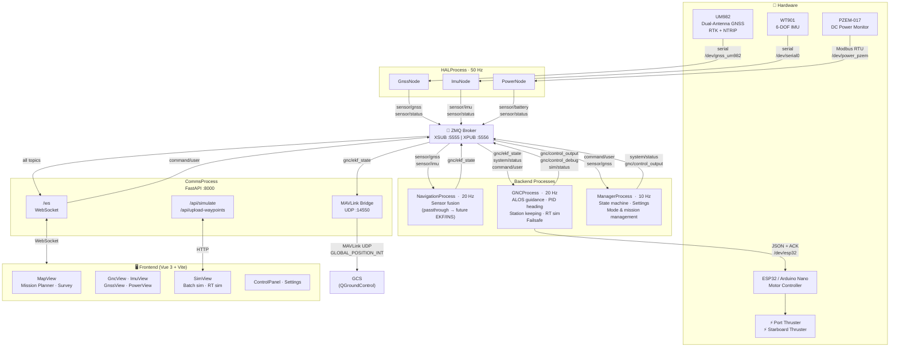

# Salpa 1 — USV Control Software

> Multi-process ground control and autonomy stack for the **Salpa 1** twin-thruster catamaran USV.  
> Built with Python (FastAPI + ZMQ) on the backend and Vue 3 on the frontend.


---

## Table of Contents

1. [Overview](#overview)
2. [System Architecture](#system-architecture)
3. [Modules](#modules)
4. [Features](#features)
5. [Hardware](#hardware)
6. [Installation & Setup](#installation--setup)
7. [Running the System](#running-the-system)
8. [In Development](#in-development)
9. [Bugs](#bugs)

---

## Overview

**Salpa 1** is a twin-pontoon catamaran USV (Unmanned Surface Vehicle) designed for coastal survey and maritime research missions. This repository contains the full software stack running on its onboard computer (Raspberry Pi / Linux SBC):

- **5 concurrent Python processes** communicating over a central ZMQ pub/sub broker
- **Hardware drivers** for GNSS (UM982 dual-antenna RTK), 6-DOF IMU (WT901), and DC power monitoring (PZEM-017)
- **GNC stack** implementing ALOS path following, PID pole-placement heading control, station keeping, and 6-DOF real-time simulation
- **Vue 3 web frontend** with interactive mission planner, real-time telemetry charts, simulation tool, and remote manual control
- **REST + WebSocket API** (FastAPI) for bidirectional frontend communication
- **MAVLink bridge** for integration with GCS tools such as QGroundControl

### Vehicle Specs

| Parameter | Value |
|-----------|-------|
| Hull | Twin-pontoon catamaran |
| Length | 2.4 m |
| Beam | 1.7 m |
| Operating draft | ~0.09 m (165 kg config) |
| Hull mass | 165 kg + up to 25 kg payload |
| Propulsion | 2× electric thrusters (differential) |
| Max speed | ~4 kn (≈ 2.06 m/s) |
| Max propeller speed | ±175.9 rad/s |
| Thruster lever arms | ±0.673 m |

---

## System Architecture


[![](https://mermaid.ink/img/pako:eNqFVt1q40YUfpWDYEuWxmv5N7EpBdtxEm8sWWs5yZKqhIk1tkWkkZBGSbObhV71qlAopRe9Kb3oM7TXfZR9gfYRes5IcqxgHF3YM5rv_H1z5ht91Oahy7WutvDD-_mKxRJmfUcAPkl6s4xZtILTy28c7b_ff_kRTlns3rOYO9q3GYaec6NzWEeE-ncccZQyv9ITkgvB4MS0bXw3nZ3Bl2DOpiOrZHs56-g1tFX_iGtXjibHMDLOSyjramggiP4qeu2AYgzACu95DEYoPBnGJfjQthCNv406VKEXu6knQjCZCNHSCBEOg1DIOPR9XrY0JrPJ1Ebjz7_9gQGIjFWcJhJhjqB3tmTxTYgsPC0U9ly4jnjOXG-MzvDXisM5TxKAf_4CaOlw-qEU90QkiYn7gOBiWFofBWm-nI_K9BAT-fp6vDOv_nRyNpxmu_o9XBnvoB-Ht6rK9_Z5H7otfAAeAd5b-bS922FvcDY0j9Bjn81vEQF5xTwppWr2LhBjsjtvyaQXihIvdcWLI2wuEtyjRZogAud7EUsSuYrDdLmCzz_8jCsyjTkMz46rI9N-XabSHBCL5mCr6954YsMy9Vwm5pxWrNERrDhzPbGkyFJlBbecR_iGANMZJF6Aa8fM8xO2KFNvnBCLBhNsyeNSxFpRDLrkELD5yhMqos2lRN-J6kWXwxcQeAlViiByE3Ahd3I9mBgG9eggDIIkj6nyS2TPGgF0D3VdL58yglfvCXXJb-wQd0iWANOhPSMIi7wqVpv6mDOC1TyN_JC5lXv2EIWekOX9NHoX45F5RhzgyBO32EieuyTj8yMLc6k1Wy19ZznHQ9WHv_75798_ARzHISmHC7B3kXJooGpceJK_fhbVUqxHFx6_Jx5zAi2fCYGiQCyn8R1_KFldjIaKiBMxJztC4WnKXdCxK96qM6Teb5rbI9Ig2wtyiz6T8xX1xkaXbOIHs-lY7ZJSGosJ7pe2fwsnJwOV34AUc-_dCTa8cHP7jIAM9urVWojVcUB9yRaUAkOl8vWjoyU89phPm-jyu-oSy7tOAxJo7XEtN5mV0t6tVtlMJ5NCd0Shx5BbYA_fpAkScF5YRUTfdfSBB2T4JEgb2ffGKvFcdMSmBMI6ExIBlTg6zmcJHqY0IbeZgmWmeW7wzBT7-CXLdXJlyxsmUdkfdlmva8lqUOU8yVq2mmF31UMpolNUxcwCB7AuYynmVX67uKbg_KXYKHhbgpZdYNgHvLKCohxHzFFCmHCraUIX2eOTFxyUE5lnbXgdpjJKJZpuvnT5TUryiUdgF1XklHLNruBV8S2xDphFe2tPTDz1eKEUDcWTqKH6Fq_0DI0DQuf39XZGclHewkqp6vVeqJ3BICjpmQ0Onjh4ztwWTl7YISXXpWxy18z3QYaRN1fhL-38VNqZjGxJeVsg5V3FKRR0w81XmZMN7X9E2c0AJP0F4HQ2s2gNpW7Dda7sL7YXcZddBzl_2aTQifx-wGuB5HY86ffG19bEHs1GE_N6ZM5U_w1U9dq-tsRrROvKOOX7WsDjgNFU-0irjiZXeEs6WheHLl-w1MeKHPEJzSImrsIwKCzVJ4PWXTA_wVkauZjnkcfw4nmCIFU8HqDUSq3bbjWVD637UftO69YazTf12kG90zis1WvtQ_1gX3vQunX94E39sNFuN1sNvd066DQ_7WsfVFj9Tad50Gx3Wp263mk26zX0x136QjWyz2zsmYW31D79D2iGrVM?type=png)](https://mermaid.ai/live/edit#pako:eNqFVt1q40YUfpWDYEuWxmv5N7EpBdtxEm8sWWs5yZKqhIk1tkWkkZBGSbObhV71qlAopRe9Kb3oM7TXfZR9gfYRes5IcqxgHF3YM5rv_H1z5ht91Oahy7WutvDD-_mKxRJmfUcAPkl6s4xZtILTy28c7b_ff_kRTlns3rOYO9q3GYaec6NzWEeE-ncccZQyv9ITkgvB4MS0bXw3nZ3Bl2DOpiOrZHs56-g1tFX_iGtXjibHMDLOSyjramggiP4qeu2AYgzACu95DEYoPBnGJfjQthCNv406VKEXu6knQjCZCNHSCBEOg1DIOPR9XrY0JrPJ1Ebjz7_9gQGIjFWcJhJhjqB3tmTxTYgsPC0U9ly4jnjOXG-MzvDXisM5TxKAf_4CaOlw-qEU90QkiYn7gOBiWFofBWm-nI_K9BAT-fp6vDOv_nRyNpxmu_o9XBnvoB-Ht6rK9_Z5H7otfAAeAd5b-bS922FvcDY0j9Bjn81vEQF5xTwppWr2LhBjsjtvyaQXihIvdcWLI2wuEtyjRZogAud7EUsSuYrDdLmCzz_8jCsyjTkMz46rI9N-XabSHBCL5mCr6954YsMy9Vwm5pxWrNERrDhzPbGkyFJlBbecR_iGANMZJF6Aa8fM8xO2KFNvnBCLBhNsyeNSxFpRDLrkELD5yhMqos2lRN-J6kWXwxcQeAlViiByE3Ahd3I9mBgG9eggDIIkj6nyS2TPGgF0D3VdL58yglfvCXXJb-wQd0iWANOhPSMIi7wqVpv6mDOC1TyN_JC5lXv2EIWekOX9NHoX45F5RhzgyBO32EieuyTj8yMLc6k1Wy19ZznHQ9WHv_75798_ARzHISmHC7B3kXJooGpceJK_fhbVUqxHFx6_Jx5zAi2fCYGiQCyn8R1_KFldjIaKiBMxJztC4WnKXdCxK96qM6Teb5rbI9Ig2wtyiz6T8xX1xkaXbOIHs-lY7ZJSGosJ7pe2fwsnJwOV34AUc-_dCTa8cHP7jIAM9urVWojVcUB9yRaUAkOl8vWjoyU89phPm-jyu-oSy7tOAxJo7XEtN5mV0t6tVtlMJ5NCd0Shx5BbYA_fpAkScF5YRUTfdfSBB2T4JEgb2ffGKvFcdMSmBMI6ExIBlTg6zmcJHqY0IbeZgmWmeW7wzBT7-CXLdXJlyxsmUdkfdlmva8lqUOU8yVq2mmF31UMpolNUxcwCB7AuYynmVX67uKbg_KXYKHhbgpZdYNgHvLKCohxHzFFCmHCraUIX2eOTFxyUE5lnbXgdpjJKJZpuvnT5TUryiUdgF1XklHLNruBV8S2xDphFe2tPTDz1eKEUDcWTqKH6Fq_0DI0DQuf39XZGclHewkqp6vVeqJ3BICjpmQ0Onjh4ztwWTl7YISXXpWxy18z3QYaRN1fhL-38VNqZjGxJeVsg5V3FKRR0w81XmZMN7X9E2c0AJP0F4HQ2s2gNpW7Dda7sL7YXcZddBzl_2aTQifx-wGuB5HY86ffG19bEHs1GE_N6ZM5U_w1U9dq-tsRrROvKOOX7WsDjgNFU-0irjiZXeEs6WheHLl-w1MeKHPEJzSImrsIwKCzVJ4PWXTA_wVkauZjnkcfw4nmCIFU8HqDUSq3bbjWVD637UftO69YazTf12kG90zis1WvtQ_1gX3vQunX94E39sNFuN1sNvd066DQ_7WsfVFj9Tad50Gx3Wp263mk26zX0x136QjWyz2zsmYW31D79D2iGrVM)


### ZMQ Topic Reference

| Topic | Publisher | Subscribers | Rate | Model |
|-------|-----------|-------------|------|-------|
| `sensor/gnss` | GnssNode (HAL) | NavigationProcess, CommsProcess | 1 Hz (configurable) | `GNSSData` |
| `sensor/imu` | ImuNode (HAL) | NavigationProcess, CommsProcess | ~20 Hz | `ImuMessage` |
| `sensor/battery` | PowerNode (HAL) | CommsProcess | 1 Hz | `BatteryMessage` |
| `sensor/status` | All HAL nodes | CommsProcess | 5 Hz (heartbeat) | `SensorStatusMessage` |
| `gnc/ekf_state` | NavigationProcess | GNCProcess, CommsProcess, MAVLink bridge | 20 Hz | `USVState` |
| `gnc/control_output` | GNCProcess, ManagerProcess | CommsProcess, ESP32 driver | 20 Hz | `ControlCmdMessage` |
| `gnc/control_debug` | GNCProcess | CommsProcess | 20 Hz | `ControlDebugMessage` |
| `system/status` | ManagerProcess | GNCProcess, CommsProcess | 10 Hz | `SystemStatusMessage` |
| `command/user` | CommsProcess (from frontend) | ManagerProcess, GNCProcess, HALProcess | on demand | `CommandMessage` |
| `sim/status` | GNCProcess (RT sim) | CommsProcess | 20 Hz | `RTSimStatus` |

---

## Modules

### Backend Processes (`src/`)

| Process | File | Hz | Responsibility |
|---------|------|----|----------------|
| **ManagerProcess** | `src/manager/process.py` | 10 | Central state machine: ARM/DISARM, mode switching, mission state, settings persistence |
| **HALProcess** | `src/drivers/process.py` | 50 | Spawns and supervises GNSS, IMU, and power sensor threads; handles sensor mute/unmute for RT sim |
| **NavigationProcess** | `src/gnc/navigation.py` | 20 | Sensor fusion: merges `sensor/gnss` + `sensor/imu` into unified `gnc/ekf_state`. Currently a passthrough (EKF not yet integrated) |
| **GNCProcess** | `src/gnc/process.py` | 20 | Main GNC loop: ALOS path following, PID heading control, station keeping, failsafes, real-time 6-DOF simulation |
| **CommsProcess** | `src/comms/manager.py` | — | FastAPI + WebSocket server (uvicorn). Bridges ZMQ ↔ frontend. Runs MAVLink bridge thread |

### Hardware Drivers (`src/drivers/`)

| Driver | File | Protocol | Device |
|--------|------|----------|--------|
| **GnssNode / UM982Driver** | `gnss_um982.py` | NMEA (serial) + NTRIP (TCP) | `/dev/gnss_um982` |
| **ImuNode / WT901Driver** | `imu.py` | Binary frames (serial) | `/dev/serial0` |
| **PowerNode / PZEMDriver** | `power_pzem.py` | Modbus RTU (serial) | `/dev/power_pzem` |
| **ESP32 driver** | `esp32.py` | JSON + ACK (serial) | `/dev/esp32` |
| **Arduino Nano driver** | `arduino_nano.py` | JSON + ACK (serial) | `/dev/arduino_nano` |

### GNC Library (`src/gnc/`)

| Module | File | Description |
|--------|------|-------------|
| **Guidance** | `guidance.py` | ALOS adaptive line-of-sight path following; 3rd-order reference model (`refModel3`) |
| **Control** | `control.py` | PID pole-placement heading controller (`PIDpolePlacement`); control allocation (`controlAllocation`) |
| **Autopilot** | `autopilot.py` | `HeadingAutopilot`, `PathFollower`, `StationKeeper`, `GNCController` |
| **Vehicle Model** | `vehicle_model.py` | `Salpa1Model`: 6-DOF nonlinear dynamics (mass matrix, damping, Coriolis, hydrostatics, cross-flow drag, propulsion) |
| **Sim Sensors** | `sim_sensors.py` | Synthetic GNSS/IMU generators for RT sim with configurable noise profiles (RTK/DGNSS/GPS) |
| **GNC Utils** | `gnc_utils.py` | Math utilities: `ssa()`, `Rzyx()`, `m2c()`, `crossFlowDrag()`, `latlon_to_ned()`, `ned_to_latlon()` |

### Frontend (`frontend/src/`)

| View / Component | Description |
|-----------------|-------------|
| **MapView** | MapLibre GL map with satellite/nautical layers, real-time vessel marker, mission waypoints, station-keeping circles, survey pattern editor, simulation overlay |
| **MissionPlannerPanel** | Waypoint list editor (drag-to-reorder), survey polygon drawing, CSV import/export |
| **GncView** | Real-time heading (actual vs desired) and motor command charts |
| **GnssView** | GNSS quality metrics: position, fix type, satellites, HDOP, dual-antenna heading |
| **ImuView** | Orientation, acceleration, angular rate, and magnetic heading charts |
| **PowerView** | Voltage, current, power, energy consumed, battery level, alarms |
| **SimView** | Offline batch simulation (multiple vehicle profiles) + real-time simulation overlay on map |
| **SettingsView** | GNC tuning (wn, ζ, δ, γ), failsafe config, GNSS/NTRIP config, battery settings |
| **ControlPanel** | ARM/DISARM toggle, mode selector (MANUAL/STATION/WP_ROUTE), SIM/REAL toggle |
| **ThrustIndicator** | SVG compass with actual/desired heading arrows + bipolar port/starboard motor bars |
| **useSurveyGenerator** | Boustrophedon (lawnmower) survey pattern generator (scanline polygon clipping, configurable angle and spacing) |
| **useManualControl** | Arcade-style keyboard (WASD) control at ~10 Hz with throttle + steering |

---

## Features

### Guidance, Navigation & Control

- **ALOS Path Following** — Adaptive Line-of-Sight algorithm (Fossen 2021, Ch. 14). Virtual target point with monotonicity constraint and adaptive sideslip compensation (β-update). Configurable look-ahead distance `δ` and adaptive gain `γ`
- **PID Pole-Placement Heading Control** — Pole-placement gains with 3rd-order reference model for smooth setpoints. Anti-windup integral clamping. Reference model unwinding prevention across ±π boundary
- **Control Allocation** — Differential twin-thruster allocation: `[τ_X, τ_N] → [n₁, n₂]` using quadratic thrust model `T = k·n·|n|`
- **Station Keeping** — Dual-radius approach: APPROACHING state uses heading + surge control toward target; IDLE state inside inner radius until drift exceeds outer radius
- **Waypoint Route** — Multi-waypoint following with configurable completion modes: `stop`, `loop`, `loop_reverse`
- **Manual Control** — Arcade differential mixing: `port = throttle + steering`, `starboard = throttle - steering`
- **Failsafe System** — GNSS loss timeout triggers `emergency_stop` or `station_keeping`; comm loss timeout triggers `return_home` or `station_keeping`

### Navigation & Sensor Fusion

- **Sensor passthrough** — GNSS heading (dual-antenna UM982, `heading_status='A'`) takes priority; falls back to IMU magnetic heading (`'M'`) if GNSS heading unavailable
- **INS/MEKF implementation** — A complete 16-state multiplicative EKF (`_old/ins_mekf_psi.py`, Fossen) is available but not yet integrated into `NavigationProcess`

### Real-Time 6-DOF Simulation

- Triggered by `START_RT_SIM` command; **mutes physical sensors** and injects synthetic GNSS/IMU data
- Physics engine: `Salpa1Model` with full nonlinear 6-DOF dynamics (Coriolis, cross-flow drag, hydrostatics, propulsion time constant)
- GNSS noise profiles: RTK Fix (0.01 m white noise), DGNSS (0.5 m + 1 m drift), GPS (2 m + 5 m drift)
- All GNC controllers run against simulated state — closed-loop simulation in the real control process
- RT sim status streamed to frontend via `sim/status` topic

### Offline Batch Simulation

- REST endpoint `POST /api/simulate` runs multiple vehicle profiles concurrently (different payloads, controller gains, sea current)
- Completion modes: `stop_time`, `one_way`, `loop`, `loop_reverse`
- Returns time series for lat/lon, NED position, heading, desired heading, CTE, motor speeds
- Frontend **SimView** renders up to 6 profiles with track overlay on the interactive map

### Sensors & Hardware Drivers

- **UM982 GNSS** — Parses NMEA sentences (GGA, GSA, THS, VTG, ZDA). Dual-antenna heading via THS message. NTRIP client for RTK corrections. Hot-swap config via `SET_GNSS_CONFIG` command. Fix types: NoFix / GPS / DGNSS / RTK Float / RTK Fix
- **WT901 IMU** — Binary frame protocol (0x51–0x54: accel, gyro, angles, magnetometer). Magnetic heading with user-configurable declination offset. Temperature reading
- **PZEM-017 Power** — Modbus RTU register polling: voltage, current, power, energy. Accumulated energy integration over time (`Wh`). Battery level estimation from capacity. `RESET_ENERGY` and `SET_BATTERY_CAPACITY` commands. High/low voltage alarms
- **ESP32 / Arduino Nano** — JSON motor command protocol with checksum-based ACK. M1/M2 (motor %), R1/R2/R3 (relay states). 200 ms ACK timeout

### Frontend & Comms

- **Interactive map** (MapLibre GL) — Satellite, OSM, dark, and nautical tile layers. Windy weather overlay. Path history trail. Click-to-place modes for waypoints, survey polygon, station, and home
- **Survey generator** — Boustrophedon lawnmower pattern inside a user-drawn polygon. Configurable track angle, line spacing, extension margin, and start corner. Accurate to ~1 m for areas < 10 km
- **WebSocket** — Full-duplex channel between frontend and backend. All ZMQ telemetry forwarded in real time. Commands sent as JSON `CommandMessage` payloads
- **Settings persistence** — `ManagerProcess` saves `gnc_config`, `failsafe_config`, and `home_wp` to `data/manager_settings.json` and reloads on startup
- **USB device management** — `usb_identify.py` interactive udev rule generator: scans connected USB-serial devices and creates stable `/dev` symlinks

---

## Hardware

| Component | Model | Interface | Symlink | Purpose |
|-----------|-------|-----------|---------|---------|
| GNSS receiver | Unicore UM982 | Serial (UART) | `/dev/gnss_um982` | Dual-antenna RTK positioning + heading |
| IMU | WitMotion WT901C-TTL | Serial (UART) | `/dev/serial0` | 6-DOF attitude, angular rates, magnetometer |
| Power monitor | Peacefair PZEM-017 | RS-485 Modbus RTU | `/dev/power_pzem` | Voltage, current, power, energy (DC bus) |
| Motor controller | ESP32 / Arduino Nano | Serial (UART) | `/dev/esp32` | Drives port and starboard thrusters; controls relays |
| Onboard computer | Raspberry Pi 4 / Linux SBC | — | — | Runs all Python processes |

### Setting Up USB Symlinks

The system relies on stable `/dev` symlinks (e.g. `/dev/gnss_um982`) created by udev rules. Use the interactive helper:

```bash
python usb_identify.py
```

Follow the prompts to assign names to connected devices. The script generates and installs rules in `/etc/udev/rules.d/99-usb-serial.rules` and also saves a JSON copy to `usb_symlink_assignments.json`.

---

## Installation & Setup

### Requirements

- Python 3.10+
- Node.js 18+ and npm (for frontend)
- Linux (udev for USB symlinks; tested on Raspberry Pi OS and Ubuntu 22.04)

### 1. Clone the Repository

```bash
git clone <repo-url>
cd ControlUSV
```

### 2. Python Backend

```bash
# Create and activate a virtual environment (recommended)
python -m venv .venv
source .venv/bin/activate   # Windows: .venv\Scripts\activate

# Install dependencies
pip install -r requirements.txt
```

### 3. Frontend

```bash
cd frontend
npm install

# Development mode (hot-reload on port 5173, proxies API to :8000)
npm run dev

# Production build (output to frontend/dist/ — served automatically by the backend)
npm run build
cd ..
```

### 4. udev Symlinks (hardware mode only)

```bash
# Interactive USB device assignment
python usb_identify.py

# Reload udev rules without rebooting
sudo udevadm control --reload-rules && sudo udevadm trigger
```

### 5. IMU Frequency (optional)

Set the WT901 output rate to 20 Hz (run once, value is saved to EEPROM):

```bash
python modify_imu_freq.py
```

---

## Running the System

```bash
# Start all processes (backend + broker)
python main.py
```

The system starts the following processes:

| Process | Hz | Port / Device |
|---------|----|---------------|
| ZMQ Broker | — | XSUB `:5555`, XPUB `:5556` |
| ManagerProcess | 10 | — |
| HALProcess | 50 | Serial devices |
| NavigationProcess | 20 | — |
| GNCProcess | 20 | Serial motor controller |
| CommsProcess | — | HTTP/WS `:8000` |

Open the web UI at **[http://localhost:8000](http://localhost:8000)** (or `http://<vehicle-ip>:8000` from a ground station on the same network).

> **Production build required** for the frontend to be served by the backend. Run `npm run build` once after installing dependencies. In development, run `npm run dev` separately and access the frontend on port 5173.

### Logs

All processes write to `logs/usv_control.log` (rotated at 10 MB, retained for 1 week) and to stdout. Log level is controlled by the `LOG_LEVEL` environment variable.

---

## In Development

> This table tracks features that are partially implemented or planned. Update the **State** and **Notes** columns as work progresses.

| ID | Feature | Description | What's Missing | State | Priority | Notes |
|----|---------|-------------|----------------|-------|----------|-------|
| D-01 | **INS / MEKF Navigation** | 16-state multiplicative EKF for INS aided by GNSS and compass. Full implementation exists in `_old/ins_mekf_psi.py` (Fossen). `NavigationProcess` is currently a raw passthrough with no filtering | Integrate `ins_mekf_psi.py` into `NavigationProcess.loop()`; add EKF initialization, process noise tuning, and GNSS outage handling | 🟡 Blocked — needs hardware test harness | HIGH | The algorithm handles gyro/accel bias estimation, WGS-84 gravity, and optional velocity aiding |
| D-02 | **RTL (Return to Launch)** | `CommandType.RTL` is defined in `models.py` but no handler exists in `ManagerProcess` or `GNCProcess` | Implement handler that sets mode to `WP_ROUTE` with single waypoint = `home_wp`, then disarms on arrival | 🔴 TODO (0%) | HIGH | `home_wp` is already persisted and configurable from the frontend |
| D-03 | **Failsafe Enforcement in ManagerProcess** | `failsafe_config` is stored and sent to GNCProcess but the Manager itself never monitors battery level, GNSS fix quality, or comm timeouts | Add monitoring timers in `ManagerProcess.loop()` mirroring those already in `GNCProcess` | 🔴 TODO (0%) | HIGH | GNCProcess has partial failsafe (GNSS + comm); battery failsafe is not implemented anywhere |
| D-04 | **Pre-arm Safety Checks** | `ARM` command is accepted unconditionally — no check that GNSS fix quality meets minimum threshold or that `home_wp` is set | Add validation gate before setting `is_armed = True`; publish rejection reason on `system/status` | 🔴 TODO (0%) | HIGH | — |
| D-05 | **MAVLink Bridge — Full Telemetry** | Bridge sends only `GLOBAL_POSITION_INT` (position + velocity). Attitude, battery, system status, and servo outputs are not forwarded | Subscribe to additional ZMQ topics and send `ATTITUDE`, `SYS_STATUS`, `BATTERY_STATUS`, `SERVO_OUTPUT_RAW` | 🟠 Partial (30%) | MEDIUM | Heartbeat and position are functional |
| D-06 | **Camera Streamer Service** | GStreamer + FFmpeg streaming pipeline partially implemented in `_old/camera_streamer.py`. Supports x264 (SW) and v4l2h264enc (HW) with auto-restart | Finish v4l2 capability detection; expose as a `ServiceProcess`; add ZMQ control (start/stop/bitrate) and `CommandType` | 🟠 Partial (70%) | MEDIUM | UDP output to QGC at configurable bitrate already coded |
| D-07 | **SettingsView → Backend Sync** | The SettingsView UI is complete (GNC tuning, failsafe params, GNSS/NTRIP config, battery capacity) but `save*()` methods do not send commands to the vehicle | Wire each save action to a `command/user` WebSocket message using the appropriate `CommandType` | 🟠 Partial (30%) | MEDIUM | Only `SET_BATTERY_CAPACITY` and `RESET_ENERGY` are wired |
| D-08 | **Process Watchdog / Auto-restart** | `main.py` checks whether child processes have died but takes no action (`pass`). A crashed process silently stops its data stream | Implement exponential-backoff restart logic in `main.py`; publish a critical alert on `system/status` | 🔴 TODO (0%) | MEDIUM | — |
| D-09 | **Dynamic Positioning (DP) Controller** | `DPpolePlacement()` (MIMO nonlinear DP) and `integralSMC()` (Fossen 2021 Eq. 16.479) exist in `simulator/control.py` but are not exposed in the production GNC stack | Port to `src/gnc/control.py`; add `CommandType.START_DP` / `STOP_DP`; integrate into `GNCProcess` | 🔴 TODO (0%) | LOW | Requires position feedback (lat/lon → NED), so depends on D-01 |
| D-10 | **GNSS Driver Auto-reconnect** | When the UM982 stops responding, the driver publishes `DISCONNECTED` status but never attempts to reopen the serial port | Add reconnect attempt after `_STATUS_TIMEOUT`; use exponential backoff | 🟡 Partial (20%) | MEDIUM | Same issue applies to IMU and PZEM drivers |
| D-11 | **Telemetry History Memory Cap** | Pinia store history arrays (`gncHistory`, `gnssHistory`, `imuHistory`, `powerHistory`) grow without bound during long missions | Enforce a maximum length (e.g. 3 600 samples ≈ 1 h at 1 Hz) with a rolling FIFO | 🔴 TODO (0%) | LOW | At 20 Hz the GNC history fills ~72 k entries/hour |
| D-12 | **Trapezoidal surge-force velocity profile** | Between consecutive waypoints the surge force was constant (`tau_X`), causing the vessel to approach turns at full cruise speed. Vessels with high rotational inertia overshoot the acceptance radius on tight turns. | Implemented `VelocityProfiler` class in `src/gnc/autopilot.py` using Salpa 1 drag model. Waypoints carry a `speed` field (passing/crossing speed [m/s], ≤0 = no constraint = cruise). Profile: decel ramp starts `_RAMP_SCALE × coast_dist` before each WP (coast_dist from analytical drag-coasting formula), tau at WP = `tau_cruise × (v_wp / v_cruise)`, symmetric accel ramp after. `GNCController` integrates the profiler: `set_waypoints()` feeds both `PathFollower` and `VelocityProfiler`; `step()` returns `tau_X` (effective) and `tau_X_cruise` (nominal) in debug; `update_tuning()` propagates `tau_X` changes to profiler. | 🟢 DONE | Ramp distance ≈ 6.9 m at cruise 150 N — safely larger than the typical 5 m acceptance radius so decel always begins before the WP switch |

---

## Bugs

> This table is a living document. Add new rows as bugs are found. Update **Actions Taken** and **Status** as fixes are applied.  
> Severity: 🔴 Critical · 🟠 High · 🟡 Medium · 🟢 Low

| ID | Description | Files Affected | When It Occurs | First Documented | Actions Taken | Status |
|----|-------------|----------------|----------------|-----------------|---------------|--------|
| B-01 | **Failsafe re-trigger loop** — After the GNSS-loss failsafe fires, `gnss_lost_since` is immediately set to `None`. If GNSS fix is still absent, the timer resets on the very next loop and the failsafe fires again every 20 Hz iteration, flooding the command bus with `DISARM` / station-keeping commands | `src/gnc/process.py` | Whenever GNSS fix is lost for longer than `ins_timeout` seconds | 2026-05-13 | Added `gnss_failsafe_active` latch; action fires once and is suppressed until GNSS is restored. Test: `tests/test_gnss_failsafe_latch.py` | 🟢 FIXED |
| B-02 | **MANUAL mode produces no motor output on real hardware** — `GNCProcess` only sent motor commands when `self.rt_sim_active == True`; manual inputs were silently discarded on real hardware. Fixed by making ARM the sole motor-output gate: REAL+ARMED enables all motor paths; SIM mode stays permanently DISARMED; auto modes blocked unless armed (REAL) or sim active | `src/gnc/process.py`, `src/manager/process.py`, `frontend/src/stores/telemetry.js`, `frontend/src/components/ControlPanel.vue`, `frontend/src/components/ThrustIndicator.vue`, `frontend/src/views/GncView.vue` | Any attempt to manually drive the vessel when RT sim is not running | 2026-05-13 | `tests/test_arm_motor_gate.py` | 🟢 FIXED |
| B-03 | **No process restart on child crash** — `main.py` periodically checks whether child processes are alive but does nothing (`pass`) if one has died. The affected subsystem (e.g. HAL, GNC) stops silently with no alert or recovery | `main.py` L39–41 | Whenever any of the 5 main service processes exits unexpectedly | 2026-05-13 | The solution: a non-blocking supervisor in main.py with exponential backoff + crash limit + ZMQ alerts, and a one-line addition in telemetry.js to surface the alerts | 🟢 FIXED |
| B-04 | **`RealGNSS` driver returns zeroed data** — `gnss.py:RealGNSS.read()` is a stub that returns a dict of zeros. In non-simulation mode, `get_gnss_driver()` may return this driver, producing invalid position data with no error indication | `src/drivers/gnss.py` L22 | `SIMULATION_MODE=False` on any system where this factory is used | 2026-05-13 | drivers/gnss.py, manager.py and base.py removed, deprecated code. Added warning log in drivers/process.py | 🟢 FIXED |
| B-05 | **HALProcess race condition on `muted` flag** — The `muted` boolean is written from the HALProcess main loop in response to `MUTE_SENSORS` / `UNMUTE_SENSORS` commands, while the three sensor threads (GnssNode, ImuNode, PowerNode) read it concurrently without any synchronization primitive | `src/drivers/process.py` | During `START_RT_SIM` or `STOP_RT_SIM` when sensor threads are actively reading | 2026-05-13 | The fix: replace the plain bool in each node with a threading.Event hidden behind a property. The external write node.muted = True/False and the internal read if self.muted: both keep working unchanged, but now go through a proper synchronisation primitive | 🟢 FIXED |
| B-06 | **Uninitialized `_station_origin` attribute** — `StationKeeper` (or the station-keeping state in `GNCProcess`) does not initialize `_station_origin` in `__init__`. If `_run_station_keeping()` is ever called before `_start_station()` completes (e.g. process restarts with persisted mode), a `AttributeError` or `NameError` is raised | `src/gnc/process.py` | If `GNCProcess` is restarted while station-keeping mode is active and the manager replays state | 2026-05-13 | Added `self._station_origin = None` in `setup()` beside other station keeping state; added early-return guard in `_run_station_keeping()` before unpacking the tuple | 🟢 FIXED |
| B-07 | **GNC config parameters not validated** — `SET_GNC_CONFIG` accepts arbitrary `payload` values and passes them directly to `GncConfig(**cmd.payload)`. Negative values for `wn` or `zeta` produce physically meaningless (and numerically unstable) control gains without any rejection or warning | `src/gnc/process.py` ~L674 | When a user sends a malformed `SET_GNC_CONFIG` command (e.g. from a buggy frontend version) | 2026-05-13 | Added `gt=0` / `ge=0` constraints to all `GncConfig` `Field()` definitions in `src/core/models.py`. Validation — saveGncConfig() now checks every field before saving. If any fail: sets gncError with a specific message listing each offending field, and does not call setGncConfig(). Error banner — rendered inside the GNC section just above the save button | 🟢 FIXED |
| B-08 | **GNSS driver does not reconnect after timeout** — `GnssNode` correctly detects when no data has been received for `_STATUS_TIMEOUT` (5 s) and publishes `DISCONNECTED` sensor status, but it never closes and reopens the serial port. A frozen or unplugged UM982 receiver requires a manual service restart | `src/drivers/gnss_um982.py` ~L490 | When the UM982 receiver freezes, disconnects, or is power-cycled | 2026-05-13 | Added `break` after timeout detection in the inner monitor loop of all three drivers (GNSS, IMU, Power), so the outer retry loop closes the serial port, waits, and restarts the driver automatically. Also fixed log spam: "Cannot open …" warnings now fire only once per disconnection event (GNSS and IMU — `_start_error_logged` flag; Power was already guarded). Fixed `WT901Driver._read_loop` using `print()` instead of `logger` — replaced with `logger.warning` + `_error_logged` once-per-error suppression. | 🟢 FIXED |
| B-09 | **Frontend `localStorage` config staleness** — On page reload, the Pinia store initialises `gncConfig`, `failsafeConfig`, and `homeWaypoint` from `localStorage`. If the backend config was changed between sessions (e.g. via another client or direct file edit), the stale frontend values are re-sent to the vehicle on the next `SET_*` command, silently overwriting the correct values | `frontend/src/stores/telemetry.js` | After a backend-side config change followed by a frontend page reload | 2026-05-13 | Removed the push-on-connect block in `ws.onopen` (which was overwriting the backend with stale localStorage). Changed `system/status` handler to always accept backend values for `gnc_config`, `failsafe_config`, and `home_wp`, and write them back to localStorage so the next reload starts with the correct values. Backend (`manager_settings.json`) is now the single source of truth; localStorage is a display cache only. | 🟢 FIXED |
| B-10 | **PID anti-windup threshold undocumented and possibly too conservative** — The integral term in `PIDpolePlacement` only accumulates when `e_ψ < 0.35 rad (~20°)`. This means heading errors beyond 20° receive no integral correction. In the presence of constant current disturbances combined with large initial heading errors, the vessel may converge to a steady-state cross-track offset | `src/gnc/control.py` ~L61 | During large-angle turns or when persistent disturbances produce heading errors > 20° | 2026-05-13 | **(1) Increased threshold to 30° (0.5236 rad) and made it configurable** via `GncConfig.e_x_threshold_deg` (adjustable 0–90° in GNC Controller Settings). **(2) Added soft integrator decay** when |e_x| >= threshold: instead of freezing, e_int now decays by 5% per cycle to prevent stale accumulation. **(3) Added output saturation with anti-windup back-calculation**: if computed torque exceeds u_max, it's clamped and Ki term is reduced by 10% to prevent integrator windup on saturation. **(4) Added propeller speed bounds checking**: controlAllocation() now accepts optional n_max, n_min and clamps n1, n2 to realistic motor limits (previously unchecked, could demand speeds beyond hardware capability). All changes preserve backward compatibility. | 🟢 FIXED |
| B-11 | **MAVLink bridge sends incomplete telemetry** — `MavlinkSender` only sends `GLOBAL_POSITION_INT` (lat, lon, alt, NED velocity). Attitude (`ATTITUDE`), battery (`BATTERY_STATUS`), system health (`SYS_STATUS`), and actuator outputs (`SERVO_OUTPUT_RAW`) are not forwarded. A GCS displays the vehicle position but cannot show its heading, battery, or health status | `src/comms/mavlink_bridge.py` | Whenever the MAVLink bridge is active (always, on startup) | 2026-05-13 | None — tracked also in D-05 | 🟡 OPEN |
| B-12 | **ZMQ context leak per `Subscriber` instance** — Each `Subscriber` object creates its own `zmq.Context()` in its constructor and never closes it. If subscribers are created and destroyed repeatedly (e.g. in unit tests or future hot-reload scenarios), contexts accumulate in memory | `src/core/messaging.py` | During rapid Subscriber creation/destruction; not an issue in normal steady-state operation | 2026-05-13 | None | 🟢 OPEN |
| B-13 | **ESP32 and Arduino Nano drivers are identical** — `arduino_nano.py` and `esp32.py` contain the exact same implementation differing only in comments. Any bug fixed in one file must be manually replicated in the other | `src/drivers/arduino_nano.py`, `src/drivers/esp32.py` | Maintenance risk; not a runtime bug | 2026-05-13 | None | 🟢 OPEN |
| B-14 | **Unused `dt` variable in `ServiceProcess` loop** — `dt = now - last_time` is computed on every iteration of the base class loop but is never passed to `loop()` or used anywhere. Subclasses that need `dt` must recompute it themselves | `src/core/process.py` L53 | Always; cosmetic issue | 2026-05-13 | None | 🟢 OPEN |
| B-15 | **Intermittent WebSocket zombie-connection — buttons send but frontend freezes** — After `main.py` restart + frontend refresh, button commands sometimes reach the backend (confirmed in logs) but the UI state never updates. Four root causes: **(1)** `broadcast()` removed failed clients from the broadcast list but never closed the WebSocket, so the browser's `onclose` never fired and the frontend stayed "connected" without receiving data. **(2)** `consume_zmq()` only caught `asyncio.CancelledError` — any `zmq.ZMQError` or other exception killed the task silently, stopping all ZMQ→WebSocket message flow permanently. **(3)** `if sub_socket.poll(100):` was not awaited on the `zmq.asyncio` socket — the synchronous variant was called instead, blocking the event loop for 100 ms on every iteration and creating a resource-leaking unawaited coroutine object. **(4)** `time.sleep(0.2)` in the `async` `startup_event()` blocked the asyncio event loop during startup, creating a race window where frontend reconnects arrived during the blocked period | `src/comms/web_server.py`, `frontend/src/stores/telemetry.js` | Intermittently after `main.py` restart followed by browser page refresh | 2026-05-14 | **Backend (`web_server.py`):** (1) Added `await connection.close()` after `self.disconnect()` in `ConnectionManager.broadcast()` so a failed send forces the client's `onclose` to fire and auto-reconnect triggers. (2) Wrapped `consume_zmq()`'s inner loop in an outer `while True` restart loop with broad `except Exception` — the task now logs the error and recreates the ZMQ socket instead of dying silently. (3) Changed `if sub_socket.poll(100):` → `if await sub_socket.poll(100):`. (4) Changed `time.sleep(0.2)` → `await asyncio.sleep(0.2)`. **Frontend (`telemetry.js`):** Added a zombie-connection detector in `ws.onopen`: a `setInterval` heartbeat checks every 2 s whether `isConnected` is true but no message has arrived in >10 s; if so, it calls `ws.close()` which triggers `onclose` → automatic reconnect. | 🟢 FIXED |

---

## Contributing

When adding a row to the **Bugs** or **In Development** tables:

- **Bugs**: Use the next sequential `B-NN` ID. Fill in all columns; use `—` for unknown fields.  
- **In Development**: Use the next sequential `D-NN` ID. Set **State** to one of: `🔴 TODO (0%)` · `🟠 Partial (X%)` · `🟡 Blocked` · `✅ Done`.
- Update **Actions Taken** and **Status** whenever a fix is attempted, even partial.

```
Bug status options:  🔴 OPEN · 🟡 IN PROGRESS · ✅ FIXED · 🔵 WONTFIX
```

---

## License

MIT License — see `LICENSE` for details.
